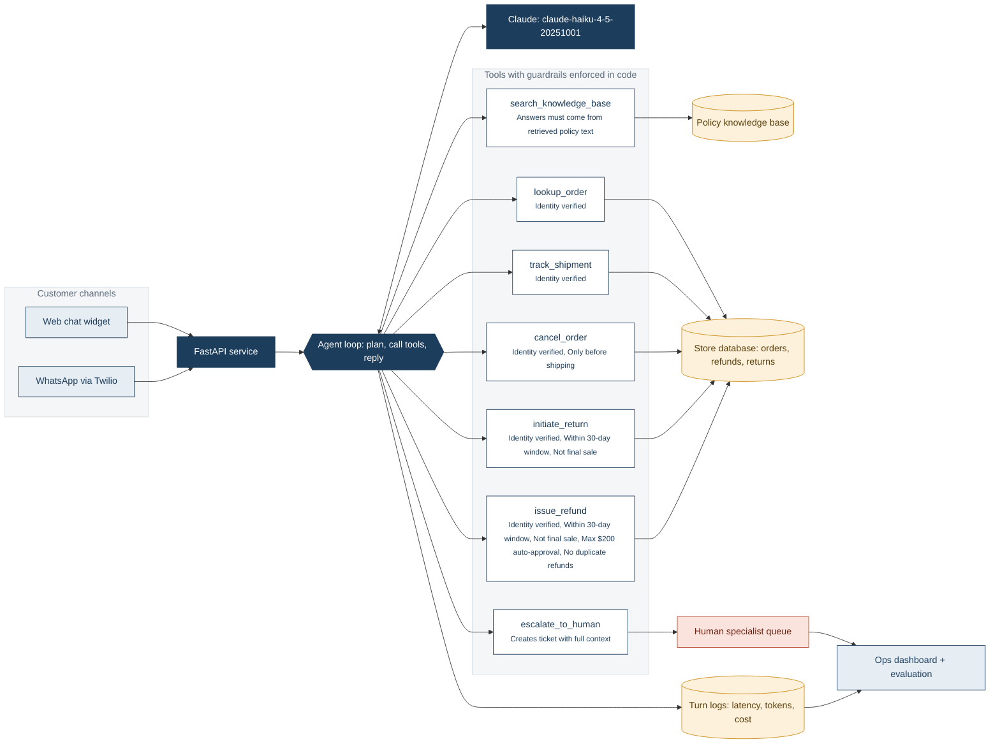
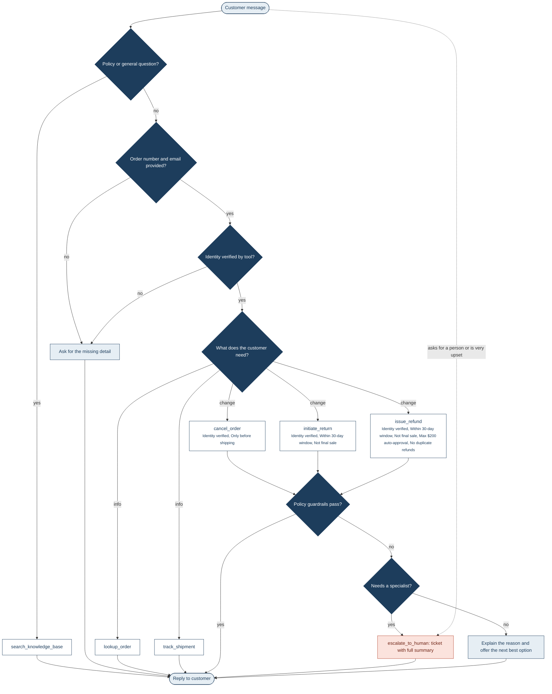

# ShopAssist architecture

These diagrams are generated from the code by `python -m app.flowchart`. Do not edit by hand.

## System architecture

```mermaid
flowchart LR
    subgraph CH["Customer channels"]
        WEB["Web chat widget"]
        WA["WhatsApp via Twilio"]
    end
    API["FastAPI service"]
    AGENT{{"Agent loop: plan, call tools, reply"}}
    LLM["Claude: claude-haiku-4-5-20251001"]
    subgraph TL["Tools with guardrails enforced in code"]
        T_search_knowledge_base["search_knowledge_base<br/><small>Answers must come from retrieved policy text</small>"]
        T_lookup_order["lookup_order<br/><small>Identity verified</small>"]
        T_track_shipment["track_shipment<br/><small>Identity verified</small>"]
        T_cancel_order["cancel_order<br/><small>Identity verified, Only before shipping</small>"]
        T_initiate_return["initiate_return<br/><small>Identity verified, Within 30-day window, Not final sale</small>"]
        T_issue_refund["issue_refund<br/><small>Identity verified, Within 30-day window, Not final sale, Max $200 auto-approval, No duplicate refunds</small>"]
        T_escalate_to_human["escalate_to_human<br/><small>Creates ticket with full context</small>"]
    end
    KB[("Policy knowledge base")]
    DB[("Store database: orders, refunds, returns")]
    HQ["Human specialist queue"]
    LOG[("Turn logs: latency, tokens, cost")]
    DASH["Ops dashboard + evaluation"]
    WEB --> API
    WA --> API
    API --> AGENT
    AGENT <--> LLM
    AGENT --> T_search_knowledge_base
    T_search_knowledge_base --> KB
    AGENT --> T_lookup_order
    T_lookup_order --> DB
    AGENT --> T_track_shipment
    T_track_shipment --> DB
    AGENT --> T_cancel_order
    T_cancel_order --> DB
    AGENT --> T_initiate_return
    T_initiate_return --> DB
    AGENT --> T_issue_refund
    T_issue_refund --> DB
    AGENT --> T_escalate_to_human
    T_escalate_to_human --> HQ
    AGENT --> LOG
    LOG --> DASH
    HQ --> DASH

    classDef channel fill:#E6EEF4,stroke:#1D3D5C,color:#1D3D5C,stroke-width:1px
    classDef core fill:#1D3D5C,stroke:#1D3D5C,color:#FFFFFF,stroke-width:1px
    classDef tool fill:#FFFFFF,stroke:#1D3D5C,color:#1D3D5C,stroke-width:1px
    classDef store fill:#FDF1DC,stroke:#C98A12,color:#5A3E08,stroke-width:1px
    classDef human fill:#FBE3DD,stroke:#B5452F,color:#6E2213,stroke-width:1px
    classDef ok fill:#E3F1EA,stroke:#2E7D5B,color:#174A33,stroke-width:1px
    classDef blocked fill:#FBE3DD,stroke:#B5452F,color:#6E2213,stroke-width:1px
    classDef user fill:#E6EEF4,stroke:#1D3D5C,color:#1D3D5C,stroke-width:1px
    class WEB,WA channel
    class API,AGENT,LLM core
    class T_search_knowledge_base,T_lookup_order,T_track_shipment,T_cancel_order,T_initiate_return,T_issue_refund,T_escalate_to_human tool
    class KB,DB,LOG store
    class HQ human
    class DASH channel
    style CH fill:#F4F6F8,stroke:#D5DEE6,color:#5B6B7B
    style TL fill:#F4F6F8,stroke:#D5DEE6,color:#5B6B7B
```

## Agent decision flow

```mermaid
flowchart TD
    MSG(["Customer message"])
    TYPE{"Policy or general question?"}
    KB["search_knowledge_base"]
    DET{"Order number and email provided?"}
    ASK["Ask for the missing detail"]
    VER{"Identity verified by tool?"}
    NEED{"What does the customer need?"}
    GUARD{"Policy guardrails pass?"}
    SPEC{"Needs a specialist?"}
    EXPLAIN["Explain the reason and offer the next best option"]
    HAND["escalate_to_human: ticket with full summary"]
    REPLY(["Reply to customer"])
    MSG --> TYPE
    TYPE -- yes --> KB --> REPLY
    TYPE -- no --> DET
    DET -- no --> ASK --> REPLY
    DET -- yes --> VER
    VER -- no --> ASK
    VER -- yes --> NEED
    NEED -- info --> R_lookup_order["lookup_order"] --> REPLY
    NEED -- info --> R_track_shipment["track_shipment"] --> REPLY
    NEED -- change --> A_cancel_order["cancel_order<br/><small>Identity verified, Only before shipping</small>"] --> GUARD
    NEED -- change --> A_initiate_return["initiate_return<br/><small>Identity verified, Within 30-day window, Not final sale</small>"] --> GUARD
    NEED -- change --> A_issue_refund["issue_refund<br/><small>Identity verified, Within 30-day window, Not final sale, Max $200 auto-approval, No duplicate refunds</small>"] --> GUARD
    GUARD -- yes --> REPLY
    GUARD -- no --> SPEC
    SPEC -- yes --> HAND --> REPLY
    SPEC -- no --> EXPLAIN --> REPLY
    MSG -. "asks for a person or is very upset" .-> HAND

    classDef channel fill:#E6EEF4,stroke:#1D3D5C,color:#1D3D5C,stroke-width:1px
    classDef core fill:#1D3D5C,stroke:#1D3D5C,color:#FFFFFF,stroke-width:1px
    classDef tool fill:#FFFFFF,stroke:#1D3D5C,color:#1D3D5C,stroke-width:1px
    classDef store fill:#FDF1DC,stroke:#C98A12,color:#5A3E08,stroke-width:1px
    classDef human fill:#FBE3DD,stroke:#B5452F,color:#6E2213,stroke-width:1px
    classDef ok fill:#E3F1EA,stroke:#2E7D5B,color:#174A33,stroke-width:1px
    classDef blocked fill:#FBE3DD,stroke:#B5452F,color:#6E2213,stroke-width:1px
    classDef user fill:#E6EEF4,stroke:#1D3D5C,color:#1D3D5C,stroke-width:1px
    class MSG,REPLY user
    class TYPE,DET,VER,NEED,GUARD,SPEC core
    class KB,R_lookup_order,R_track_shipment,A_cancel_order,A_initiate_return,A_issue_refund tool
    class HAND human
    class ASK,EXPLAIN channel
```
